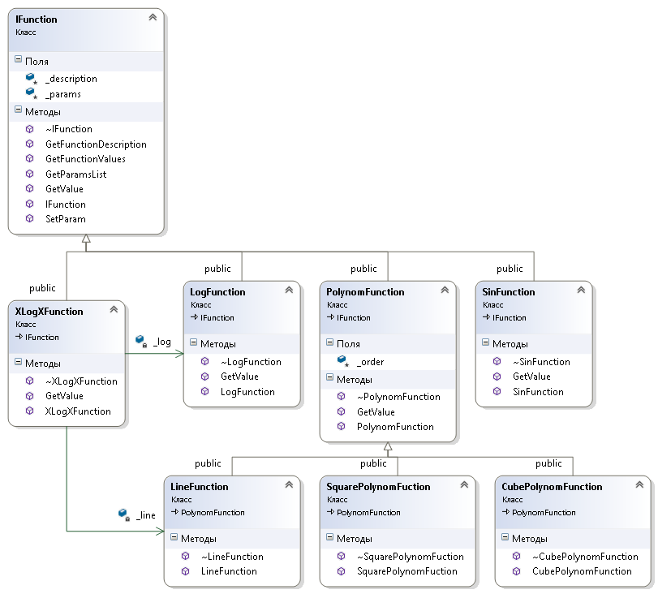

# Обзор проекта FunctionAnalyzer

Само приложение пока ничего не делает кроме как создание объектов функций
и заполнение выпадающих списков описаниями этих функций.

# Описание

Программа визуального сравнения двух математических функций y=f(x). 

Данная программа позволяет задать две математические функции и отобразить 
их графики на одной координатной координатной плоскости для последующей оценки. 
Приложение кроссплатформенное (Windows, Linux).

Это может быть полезно для решения таких задач, как оценка временной сложности 
выполнения алгоритмов; нахождение корней функций; нахождение корней уравнений, 
левые и правые части которых заданы этими двумя функциями соответственно; 
сравнение интегралов(определенных и неопределенных) функций.

Функции задаются из предопределенного набора путём спецификации их параметров. Набор может состоять 
например из следующих типов: полином N-ой степени (скорее всего нет смысла делать 
произвольные полиномы, а ограничиться несколькими начальными порядками, скажем до 5), 
показательная функция, логарифмическая, синусоида и т.п. Возможны также композиции неких базовых типов функций. 
Параметрами например полинома будут его коэффициенты. 

Математические функции реализуются соответствующими классами, которые могут быть унаследованы от 
некоторых базовых и/или могут являться их композицией. У всех классов помимо этого есть общий интерфейс, для построения графиков.

# Сторонние библиотеки и фреймворки

Для реализации графического интерфейса приложения было решено испльзовать библиотеку QT. 
Достоинства:
* кросплатформенность; 
* поддержка многопоточности (в планах на будущее вычисления производить в отдельных потоках);
* поддержка мультиязычности;
* сигналы и слоты.

Для отрисовки графиков выбрана библиотека QWT (Qt Widgets for Technical Applications)[http://qwt.sourceforge.net/].
Приемущества перед QT Charts:
* большая гибкость создания графиков;
* большая производительность.

# Диаграмма классов 
